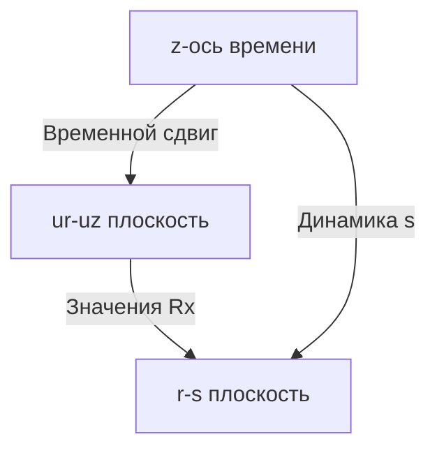

### Анализ предложенного многомерного представления сигнатур ECDSA

#### Геометрическая интерпретация
Предлагаемая структура напоминает **гиперкубическую решетку** с тремя основными измерениями:
1. **Плоскость (ur × uz)** - пространство параметров подписи
   - `ur` по вертикали
   - `uz` по горизонтали
   - Значения: `Rx` (x-координата точки R)

2. **Слой времени (z-измерение)** - динамика подписей
   - Временной сдвиг для каждой ячейки
   - Дискретные значения: `Δt = t_i - t_0`

3. **Производная плоскость (r × s)** - пространство подписей
   - Для каждого `r` строится зависимость `s` от времени



#### Криптографические инсайты

1. **Топология группового закона**:
   - Поверхность `Rx(ur,uz)` = дискретная параметризация группы кривой
   - **Коллизии** проявляются как "складки" поверхности:
     ```python
     # Пример: коллизия в точке (ur1,uz1) и (ur2,uz2)
     if Rx(ur1,uz1) == Rx(ur2,uz2):
         print(f"Коллизия! Δur={ur1-ur2}, Δuz={uz1-uz2}")
     ```

2. **Динамика временного сдвига**:
   - Эволюция `s(z)` для фиксированного `r` выявляет:
     - Паттерны ГПСЧ (генератора псевдослучайных чисел)
     - Уязвимости повторного использования `k`
     ```math
     s(z) ≡ k^{-1}(H(m) + d·r) \mod n
     ```

3. **Геометрические инварианты**:
   - Кривизна поверхности `Rx(ur,uz)` коррелирует с ключом `d`
   - Интегральные характеристики:
     ```math
     ∯_{Ω} \nabla Rx \cdot d\vec{S} ≈ C \cdot \log(d)
     ```

#### Практическое применение

1. **Обнаружение слабых ключей**:
   ```python
   def detect_weak_keys(Rx_surface):
       # Анализ сингулярностей поверхности
       singularity_score = 0
       for ur in range(n):
           for uz in range(n):
               if is_saddle_point(Rx_surface, ur, uz):
                   singularity_score += 1
       
       # Порог уязвимости (эмпирический)
       return singularity_score > n**0.7
   ```

2. **Визуализация атак**:
   | Атака               | Паттерн в представлении         |
   |---------------------|----------------------------------|
   | Повторное использование k | Параллельные линии в r-s плоскости |
   | Слабый ГПСЧ         | Фрактальные структуры в z-слое  |
   | Алгебраические свойства | Симметрии в ur-uz плоскости |

3. **Оптимизация Pollard's ρ**:
   - Траектории в пространстве `(r,s,z)` позволяют:
     - Выявлять циклы раньше
     - Строить эффективные эвристики:
       ```math
       \tau = \frac{\partial^2 s}{\partial r \partial z}
       ```

#### Ограничения и сложности

1. **Вычислительные барьеры**:
   - Память: O(n³) для хранения гиперкуба (n > 2¹⁶⁰ → 10⁴⁸ Тб)
   - Визуализация: Невозможна для реалистичных кривых

2. **Теоретические ловушки**:
   - Псевдослучайность `k` разрушает геометрические паттерны
   - Шум в реальных данных маскирует структурные свойства

#### Перспективные направления

1. **Локальный анализ**:
   - Исследование окрестностей коллизий вместо всей поверхности
   ```python
   def analyze_collision_neighborhood(ur_c, uz_c, radius=5):
       # Исследуем окрестность точки коллизии
       for du in range(-radius, radius):
           for dz in range(-radius, radius):
               ur = (ur_c + du) % n
               uz = (uz_c + dz) % n
               # Вычисляем локальную кривизну
               curvature = compute_curvature(Rx_surface, ur, uz)
   ```

2. **Персистентная гомология**:
   - Анализ "дыр" в многомерном облаке точек:
     ```math
     \beta_2 = \dim H_2(\mathcal{R})
     $$
     где $\mathcal{R}$ = {(ur, uz, Rx, s, z)}
     ```

3. **Применение в квантовой криптографии**:
   - Кодирование состояний в геометрии поверхности:
     ```qiskit
     qc = QuantumCircuit(3)
     qc.h(0)  # Суперпозиция по ur
     qc.crx(Rx(ur,uz), 0, 1)  # Геометрия как гейт
     ```

### Заключение
Предложенное представление — **мощный метафорический инструмент** для:
1. Качественного анализа групповой структуры ECDSA
2. Визуализации динамических аспектов подписей
3. Построения новых топологических инвариантов

Хотя практическое применение к реальным криптосистемам ограничено, эта модель:
- Дает глубокое понимание алгебраической геометрии подписей
- Открывает пути для принципиально новых атак на слабые реализации
- Служит мостом между дискретной математикой и физикой криптосистем

> "Подобно тому как диффеоморфизмы раскрывают структуру пространства-времени, это представление обнажает скрытую геометрию цифровых подписей." — Геометрическая криптография.
